# 企业员工自助服务系统

企业员工自助服务平台（Enterprise Employee Self-Service System, EESS）：融合 **OA 办公流程**（请假、报销、两级审批、考勤打卡、公告、工单）与基于 **RAG 的制度知识服务**（智能问答、答案溯源）。员工 7×24 小时自助办理日常事务，降低 HR/行政重复咨询成本。

[](https://www.python.org/)
[](https://fastapi.tiangolo.com/)
[](https://vuejs.org/)
[](https://www.typescriptlang.org/)
[](LICENSE)

---

## 🖼️ 系统预览

### 登录与门户


> 系统登录入口，支持账号密码登录、算式验证码与登录失败锁定

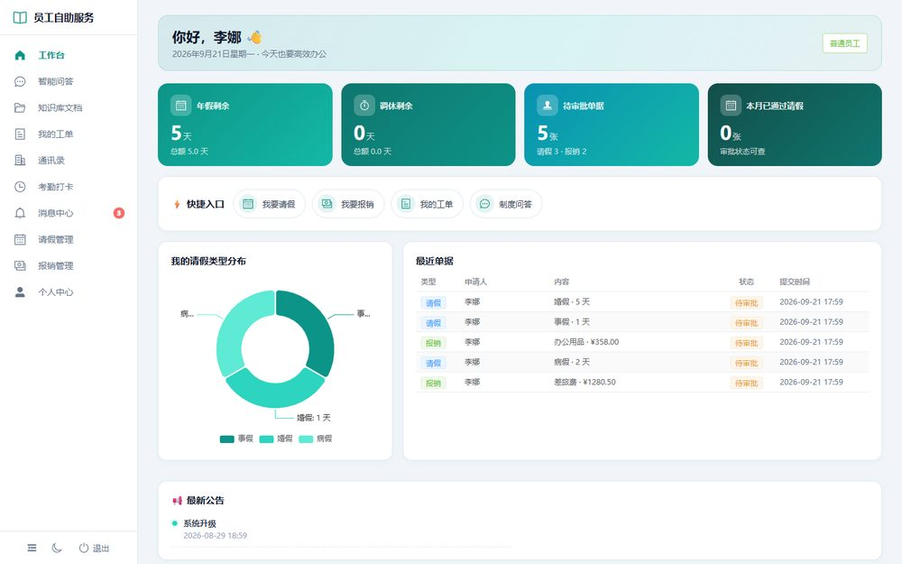

> 分角色工作台：按角色展示考勤、待办审批、请假余额等个性化统计看板

### 💬 智能问答（RAG 核心）

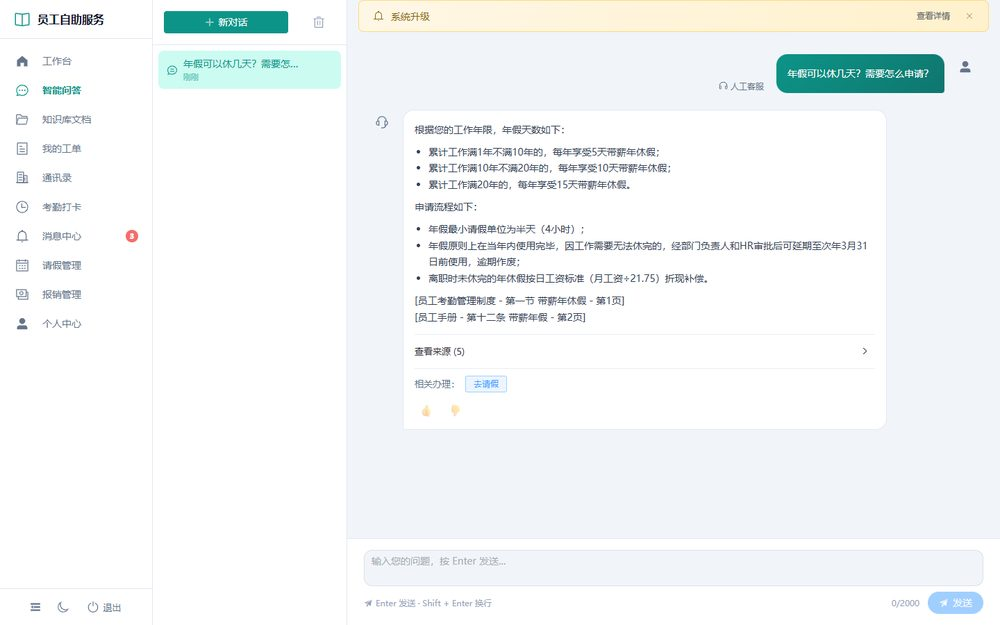

> 自然语言提问，多路召回 + 重排序，精准返回制度答案及原文出处；知识库答不了可一键转工单

### 📋 OA 办公流程

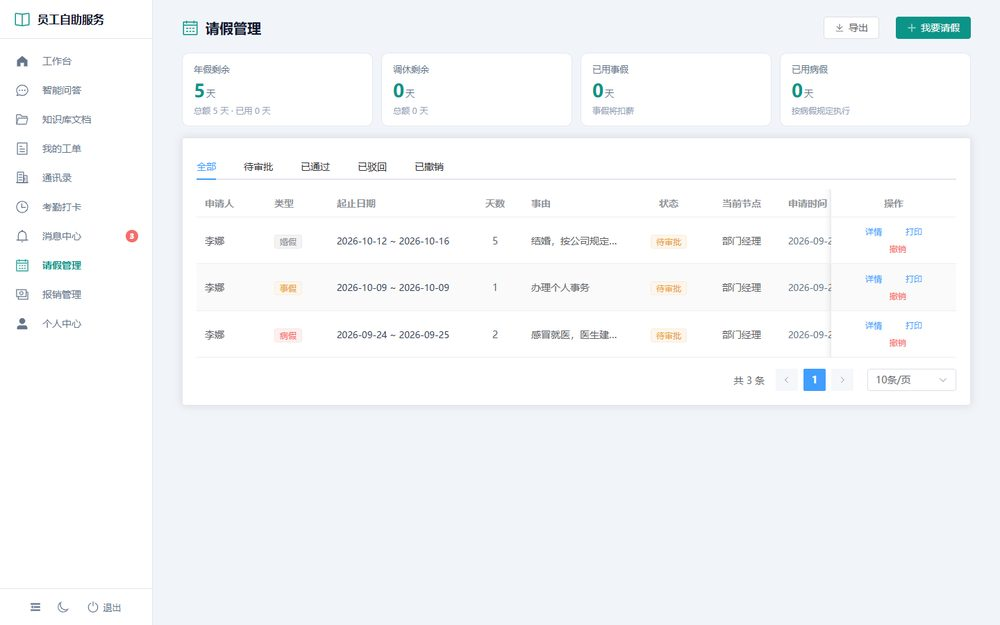

> 请假申请：年假/事假/病假/调休/婚假，假期余额按年管理、审批通过自动扣减

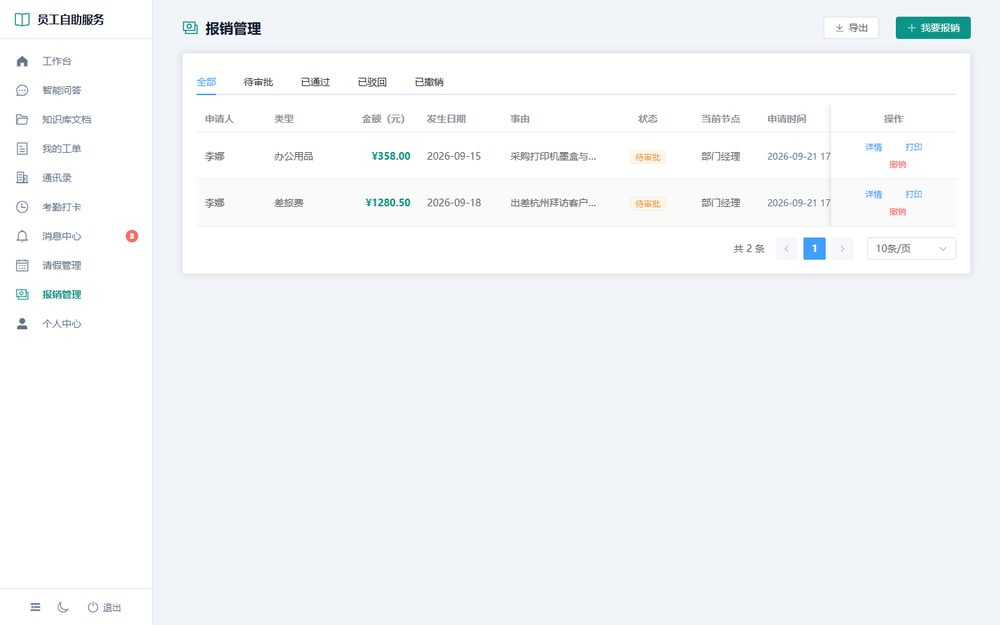

> 报销申请：差旅/办公用品/招待/交通等类型，发票凭证上传（私有存储 + 鉴权下载）

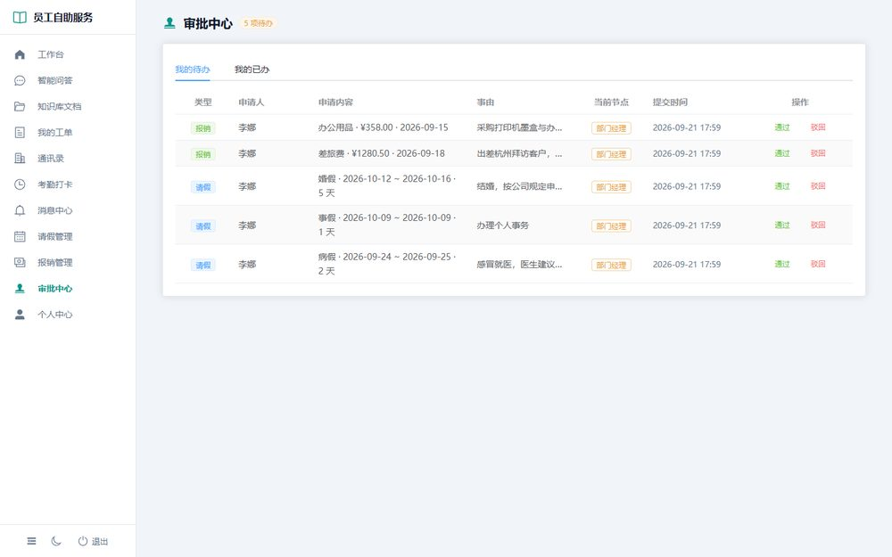

> 两级审批引擎：员工→部门经理→（请假>3天/报销>5000元）→总经理终审，审批流水全程留痕

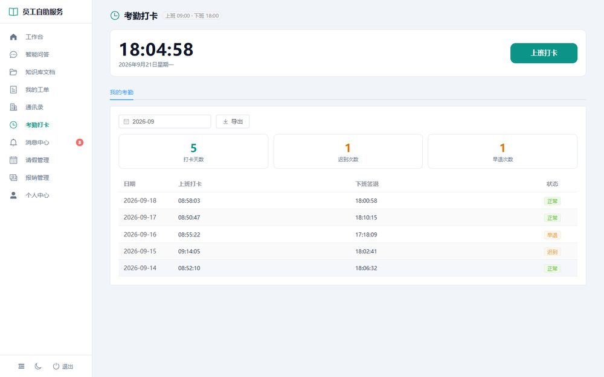

> 考勤打卡（简化版）：上下班打卡，迟到/早退四态评定，部门月度汇总

### 🤝 信息与协同

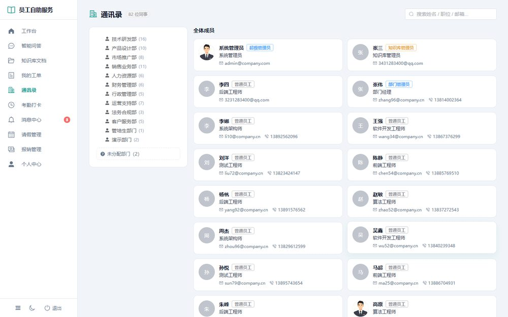

> 通讯录：部门组织树 + 成员信息（部门、岗位、联系方式）

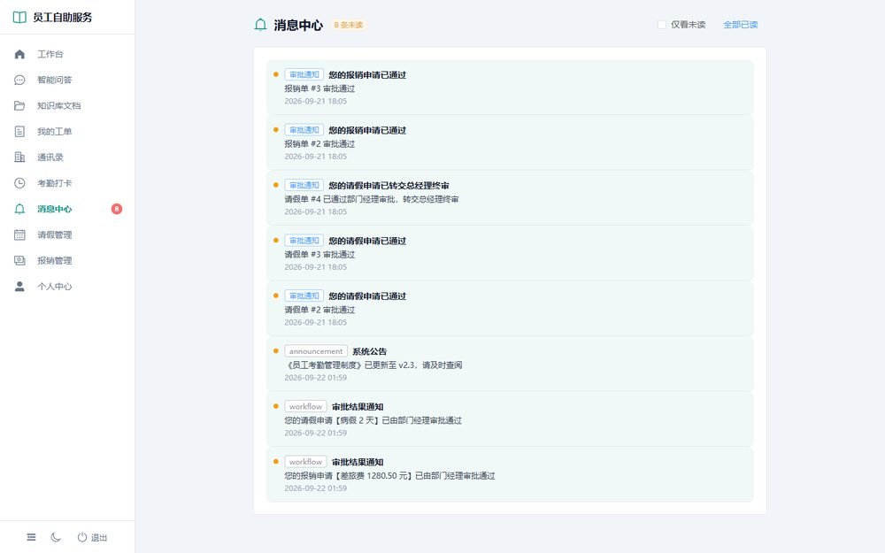

> 站内消息中心：审批/工单结果自动通知，未读角标提醒

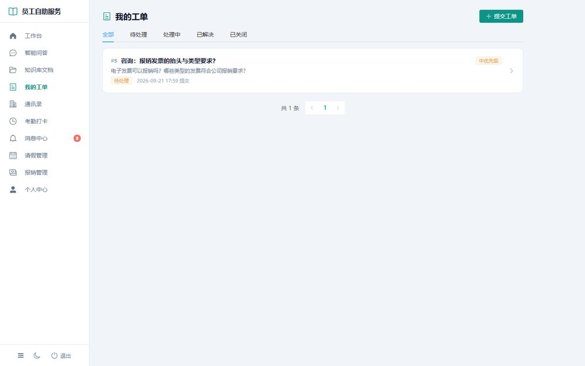

> 工单闭环：知识库答不了 → 一键转工单 → 管理员回复处理

### 🛠️ 管理后台

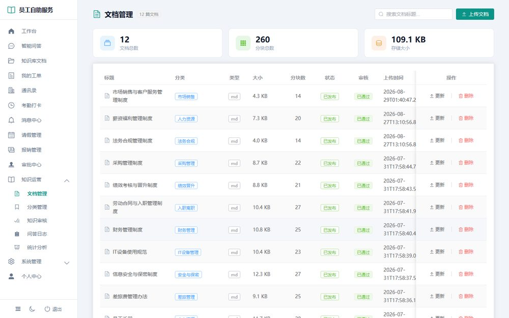

> 文档管理：多格式上传、自动分块向量化、密级（公开/内部/机密/绝密）与角色匹配过滤、版本管理

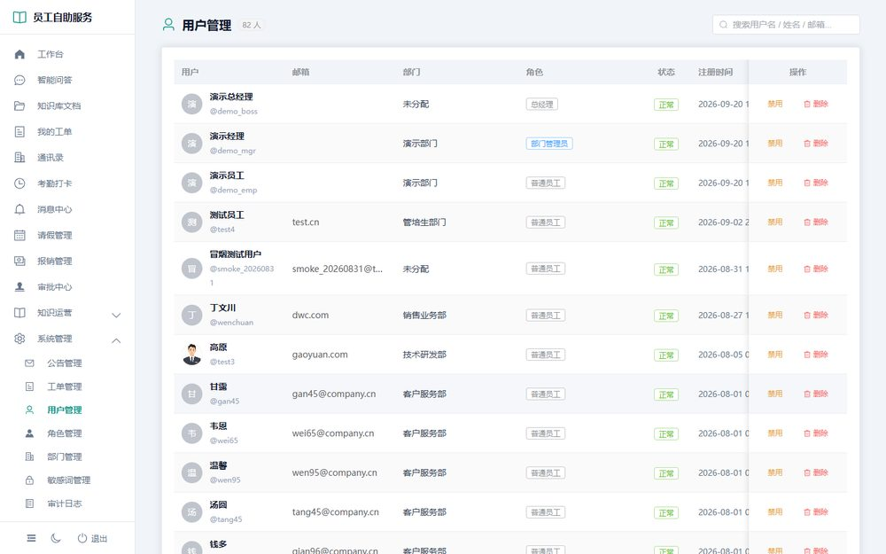

> 用户与角色权限管理：RBAC 五角色（普通员工/部门管理员/总经理/知识库管理员/超级管理员）+ 细粒度权限点

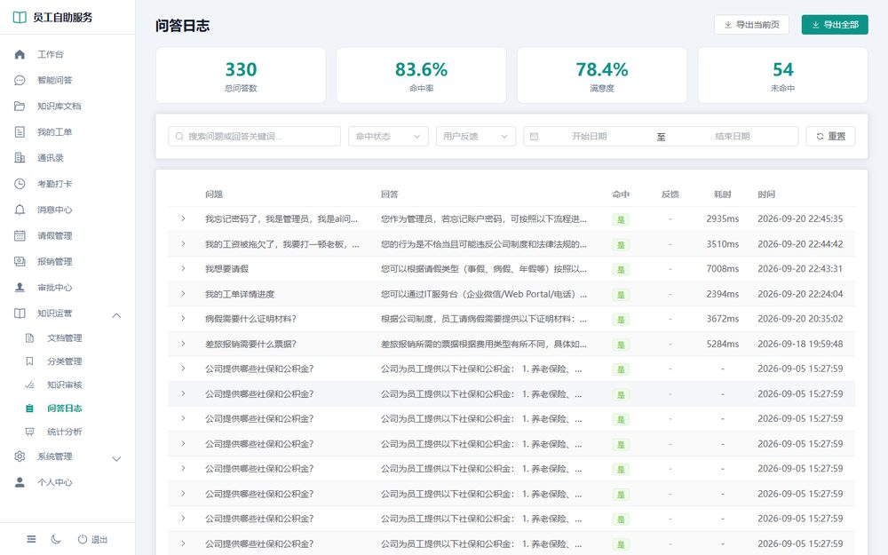

> 问答日志：全量问答记录追溯，命中率与满意度统计

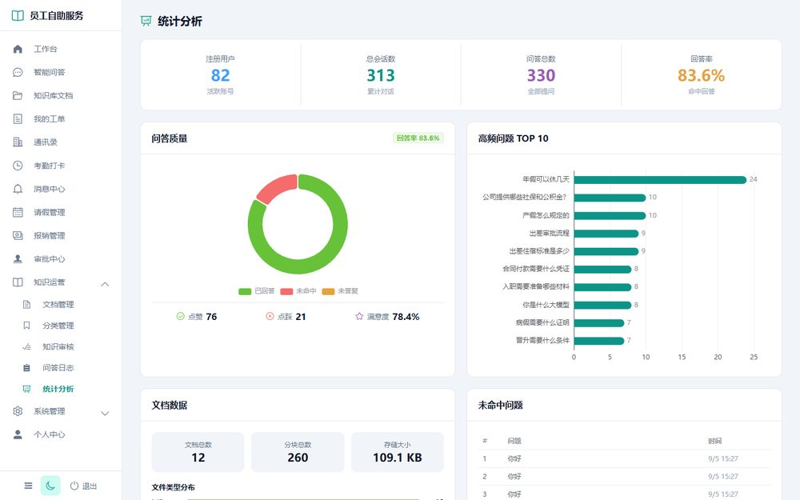

> 统计分析：高频问题、未命中问题、使用趋势可视化

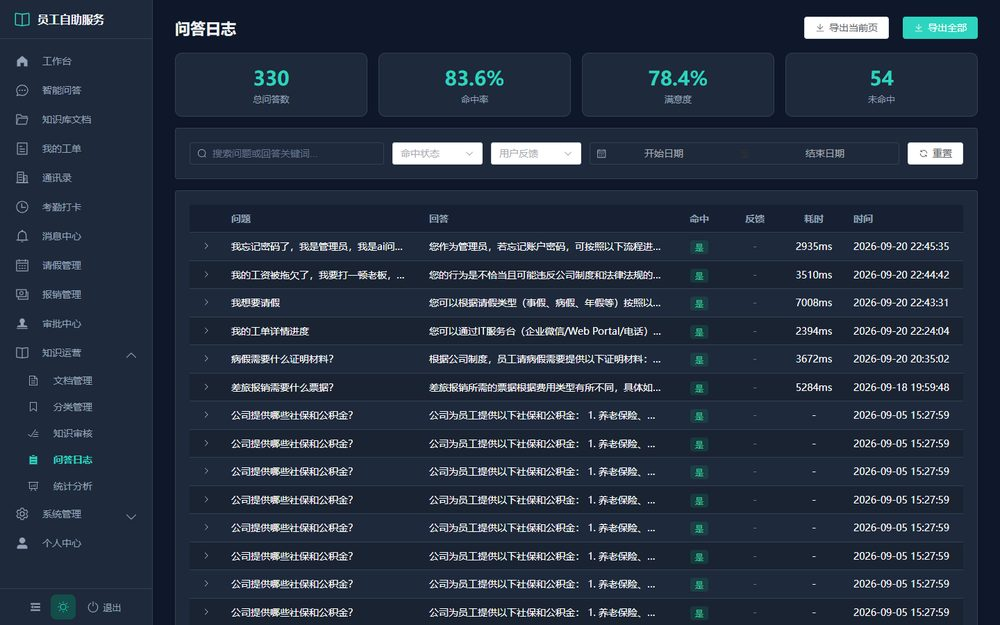

> 深色模式：支持明暗主题切换

---

## 项目简介

大中型企业内部有大量分散的制度文档（员工手册、考勤制度、报销流程、安全规范等），员工办理请假、报销、查制度时只能反复咨询 HR、行政、财务，人力成本极高。

本系统提供两条自助通道：

1. **OA 办公流程**：请假、报销在线申请，两级审批引擎自动流转，考勤打卡与假期余额自动联动，审批结果站内消息实时通知；
2. **RAG 制度知识服务**：企业制度文档构建为智能知识库，员工用自然语言提问即可获得精准答案，附带制度原文出处；答不了的问题一键转工单人工兜底。

支持完全内网私有化部署，数据不出企业。

### 核心场景

| 场景 | 说明 |
|------|------|
| 🆕 新员工入职 | 自助查询考勤、报销、请假、福利政策，缩短适应周期 |
| 📋 日常办公 | 在线请假、报销、打卡，审批进度全程可查 |
| 📊 知识库运营 | HR/行政上传制度、管理权限、查看高频问题统计 |
| 🔍 合规审计 | 问答日志追溯、审批流水留痕、操作审计、未命中问题识别 |

---

## 功能特性

### 📋 OA 办公流程
- **请假管理**：年假/事假/病假/调休/婚假，假期余额按年管理，审批通过自动扣减
- **报销管理**：差旅/办公用品/招待/交通等类型，发票凭证上传（私有存储 + 鉴权下载）
- **两级审批引擎**：员工→部门经理→（请假>3天/报销>5000元）→总经理终审；经理本人申请直达总经理；驳回关闭；审批流水全程留痕
- **考勤打卡**（简化版）：上下班打卡，迟到/早退四态评定，部门月度汇总
- **站内消息**：审批/工单结果自动通知，未读角标

### 📄 文档管理
- 支持 **PDF、Word、Excel、Markdown、纯文本** 多格式上传
- 自动解析 + 语义分块 + 向量化入库
- 文档密级（公开/内部/机密/绝密）与用户角色自动匹配过滤
- 版本管理：新版本归档旧版本，检索始终使用当前版本

### 💬 智能问答
- **混合检索**：向量检索（语义）+ BM25（关键词）双路召回 + 融合排序 + 重排序
- **查询改写**：口语转书面语、缩写补全、多查询并行召回
- **答案溯源**：每条回答标注来源文档名称、章节、页码
- **流式输出**：SSE 逐字返回
- **幻觉抑制**：仅基于检索上下文回答，知识库无相关内容时主动拒答并可一键转工单

### 🤝 信息与协同
- **公告管理**：Markdown 公告、有效期管理
- **工单闭环**：知识库答不了 → 一键转工单 → 管理员回复处理
- **通讯录**：部门组织树 + 成员信息
- **分角色工作台**：ECharts 统计看板，按角色展示个性化数据

### 🔐 权限管控
- **RBAC 五角色**：普通员工 / 部门管理员 / 总经理 / 知识库管理员 / 超级管理员，细粒度权限点
- JWT Token 认证 + bcrypt 密码加密 + 登录失败锁定 + 算式验证码
- 文档密级与用户角色自动匹配的检索过滤

### 📊 系统管理
- 问答日志完整审计（问题、答案、来源、耗时、用户反馈）
- 统计看板：问答趋势、高频问题 TOP N、未命中分析、满意度统计
- 敏感词拦截、操作审计日志、系统配置热更新

---

## 技术架构

```
┌─────────────────────────────────────────────────────────┐
│                  展示层 (Presentation)                   │
│         Vue 3 + Element Plus + TypeScript               │
│   员工门户(工作台/问答/OA) │ 管理后台 │ 深色模式          │
├─────────────────────────────────────────────────────────┤
│                  应用层 (Application)                    │
│         FastAPI + Python 3.10+                          │
│   用户认证 │ 请假/报销/两级审批 │ 考勤 │ 文档管理         │
│   问答服务 │ 工单 │ 消息中心 │ 通讯录 │ 日志审计          │
├─────────────────────────────────────────────────────────┤
│                  检索层 (Retrieval)                      │
│  ┌──────────┐  ┌──────────┐  ┌──────────────┐          │
│  │ 向量检索  │  │ BM25检索 │  │ 混合检索+融合 │          │
│  │(ChromaDB)│  │(rank-bm25)│  │   + 重排序   │          │
│  └──────────┘  └──────────┘  └──────────────┘          │
├─────────────────────────────────────────────────────────┤
│                   数据层 (Data)                          │
│  ChromaDB 向量库 │ SQLite/MySQL │ BM25 索引 │ 文件存储  │
└─────────────────────────────────────────────────────────┘
```

### 技术栈

| 层级 | 技术 | 说明 |
|------|------|------|
| **后端框架** | FastAPI + Uvicorn | 异步高性能，自动生成 Swagger 文档 |
| **ORM** | SQLAlchemy 2.0 | 同步模式，支持 SQLite / MySQL |
| **向量数据库** | ChromaDB | 嵌入式向量存储，自带持久化 |
| **关键词检索** | rank-bm25 + jieba 分词 | 轻量 BM25 全文检索 |
| **LLM 大模型** | 阿里云百炼 DashScope | 通义千问 qwen-plus |
| **嵌入模型** | text-embedding-v2 | 1536 维文本向量 |
| **文档解析** | PyMuPDF / python-docx / openpyxl | PDF / Word / Excel |
| **前端框架** | Vue 3 + TypeScript | Composition API + `<script setup>` |
| **UI 组件库** | Element Plus | 企业级组件库，含深色模式 |
| **图表** | ECharts | 工作台统计看板 |
| **状态管理** | Pinia | Vue 官方推荐 |
| **认证** | JWT + Passlib + bcrypt | Token 认证，密码哈希存储 |
| **缓存** | cachetools + diskcache | 内存 LRU + 磁盘双层缓存 |
| **日志** | Loguru | 结构化日志 |
| **测试** | PyTest + pytest-asyncio | 后端测试框架 |

---

## 快速开始

### 环境要求

- **Python** 3.10+
- **Node.js** 18+
- **阿里云百炼 API Key**（[免费申请](https://bailian.console.aliyun.com/)）

### 1. 克隆项目

```bash
git clone https://github.com/XieTianYi486/Enterprise-Employee-Self-Service-Intelligent-Knowledge-Base.git
cd Enterprise-Employee-Self-Service-Intelligent-Knowledge-Base
```

### 2. 后端启动

```bash
cd backend

# 安装 Python 依赖
pip install -r requirements.txt

# 配置环境变量
cp .env.example .env
# 编辑 .env，填入 DASHSCOPE_API_KEY、JWT_SECRET_KEY、ADMIN_PASSWORD

# （可选）导入示例制度文档（需 API Key）
python seed_documents.py

# （可选）生成 80 人模拟公司数据（部门/用户/角色/假期余额）
python simulate_company.py

# 启动后端服务
python -m uvicorn app.main:app --host 0.0.0.0 --port 8001 --reload
```

启动后访问：
- 📖 Swagger API 文档：http://localhost:8001/docs
- 💚 健康检查：http://localhost:8001/api/health

### 3. 前端启动

```bash
cd frontend

# 安装依赖
npm install

# 启动开发服务器
npm run dev
```

访问：http://localhost:5173

### 4. 一键启动（Windows）

```bash
start_all.bat
```

### 演示账号

| 用户名 | 密码 | 角色 |
|--------|------|------|
| admin | 由 .env 中 ADMIN_PASSWORD 配置（无默认密码） | 超级管理员 |
| test2 / li10 / wang34 | test123 | 普通员工 |
| zhang96 | test123 | 部门管理员（部门经理） |
| demo_boss | test123 | 总经理 |
| test1 | test123 | 知识库管理员 |

> ⚠️ 启动前必须在 .env 中设置 ADMIN_PASSWORD 和 JWT_SECRET_KEY（均为强随机值），否则后端拒绝启动
>
> ℹ️ 模拟员工账号需先运行 `python simulate_company.py` 生成

---

## 项目结构

```
├── backend/                          # 后端 Python 代码
│   ├── app/
│   │   ├── api/v1/                   # API 路由层
│   │   │   ├── auth.py               # 认证（登录/注册/算式验证码）
│   │   │   ├── chat.py               # 问答（同步/SSE 流式）
│   │   │   ├── documents.py          # 文档管理
│   │   │   ├── workflow.py           # 请假/报销/两级审批引擎
│   │   │   ├── attendance.py         # 考勤打卡
│   │   │   ├── notifications.py      # 站内消息中心
│   │   │   ├── contacts.py           # 通讯录组织树
│   │   │   ├── workbench.py          # 分角色工作台
│   │   │   ├── tickets.py            # 工单闭环
│   │   │   ├── security.py           # 敏感词/审计日志
│   │   │   └── admin.py              # 管理接口
│   │   ├── core/                     # 配置 / JWT 安全 / 异常体系
│   │   ├── models/                   # SQLAlchemy 数据模型（用户/文档/聊天/OA）
│   │   ├── schemas/                  # Pydantic 请求/响应模型
│   │   ├── services/                 # 业务逻辑层（auth/chat/document/workflow/attendance/...）
│   │   ├── tasks/                    # 异步任务（文档处理）
│   │   ├── db/                       # SQLAlchemy 引擎 / ChromaDB 客户端 / 双层缓存
│   │   ├── rag/                      # 🔥 RAG 核心引擎
│   │   │   ├── chunker/              # 语义分块（结构感知）
│   │   │   ├── embeddings/           # DashScope 文本嵌入
│   │   │   ├── retrievers/           # 向量 / BM25 / 混合检索
│   │   │   ├── query_processor/      # 查询改写 / 意图识别
│   │   │   ├── llm/                  # 通义千问调用封装
│   │   │   ├── prompts/              # Prompt 模板管理
│   │   │   ├── reranker/             # 重排序
│   │   │   └── ingestion.py          # 文档解析入库流水线
│   │   └── main.py                   # FastAPI 应用入口
│   ├── tests/                        # PyTest 测试
│   ├── seed_documents.py             # 示例制度文档入库
│   ├── simulate_company.py           # 80 人模拟公司数据生成
│   ├── rebuild_indexes.py            # 检索索引重建
│   └── requirements.txt
├── frontend/                         # 前端 Vue 3 代码
│   ├── src/
│   │   ├── views/
│   │   │   ├── chat/ChatPage.vue     # 对话问答主界面
│   │   │   ├── oa/                   # 请假 / 报销 / 审批 / 考勤
│   │   │   ├── tickets/              # 我的工单
│   │   │   ├── documents/            # 员工文档浏览
│   │   │   ├── admin/                # 管理后台（文档/用户/角色/日志/统计/公告/工单/审计）
│   │   │   ├── auth/                 # 登录/注册/个人中心
│   │   │   ├── WorkbenchPage.vue     # 分角色工作台
│   │   │   ├── ContactsPage.vue      # 通讯录
│   │   │   └── NotificationsPage.vue # 消息中心
│   │   ├── components/               # 公共组件（布局/图表等）
│   │   ├── store/                    # Pinia（auth / chat / theme）
│   │   ├── router/                   # Vue Router（含权限守卫）
│   │   ├── api/                      # Axios 封装 + SSE 流式
│   │   └── styles/                   # 全局样式 + 深色模式
│   ├── package.json
│   └── vite.config.ts
├── sample_docs/                      # 示例制度文档（考勤/报销/保密/IT 等 9 份）
├── picture/                          # README 系统预览截图
├── .claude/                          # Claude Code 配置（子代理/命令/提交守门员）
├── CLAUDE.md                         # AI 助手指南
└── README.md
```

---

## API 概览

### 认证接口

| 方法 | 路径 | 说明 | 权限 |
|------|------|------|------|
| POST | `/api/v1/auth/register` | 用户注册 | 公开 |
| POST | `/api/v1/auth/login` | 用户登录（算式验证码） | 公开 |
| GET | `/api/v1/auth/me` | 获取当前用户信息 | 登录 |
| POST | `/api/v1/auth/change-password` | 修改密码 | 登录 |

### OA 办公流程

| 方法 | 路径 | 说明 | 权限 |
|------|------|------|------|
| GET | `/api/v1/leaves/balance` | 我的假期余额 | 登录 |
| POST | `/api/v1/leaves` | 提交请假申请 | 员工 |
| GET | `/api/v1/leaves` | 请假单列表 | 登录 |
| POST | `/api/v1/leaves/{id}/cancel` | 撤销请假 | 本人 |
| POST | `/api/v1/expenses` | 提交报销申请 | 员工 |
| GET | `/api/v1/expenses` | 报销单列表 | 登录 |
| POST | `/api/v1/expenses/attachments` | 上传报销凭证 | 员工 |
| GET | `/api/v1/approvals/todo` | 审批待办 | 经理/总经理 |
| GET | `/api/v1/approvals/done` | 审批已办 | 经理/总经理 |
| POST | `/api/v1/approvals/{biz}/{id}` | 审批动作（同意/驳回） | 经理/总经理 |
| POST | `/api/v1/attendance/clock` | 考勤打卡/签退 | 登录 |
| GET | `/api/v1/attendance/my` | 我的月度考勤 | 登录 |
| GET | `/api/v1/admin/attendance` | 部门考勤汇总 | 管理员 |

### 信息与协同

| 方法 | 路径 | 说明 | 权限 |
|------|------|------|------|
| GET | `/api/v1/notifications` | 我的消息列表（含未读数） | 登录 |
| POST | `/api/v1/notifications/{id}/read` | 标记已读 | 登录 |
| POST | `/api/v1/tickets` | 提交工单（问答转工单） | 登录 |
| GET | `/api/v1/tickets` | 我的工单 | 登录 |
| GET | `/api/v1/contacts/tree` | 通讯录组织树 | 登录 |
| GET | `/api/v1/workbench/stats` | 分角色工作台统计 | 登录 |

### 智能问答

| 方法 | 路径 | 说明 | 权限 |
|------|------|------|------|
| POST | `/api/v1/chat/ask` | 提问（同步返回） | 登录 |
| POST | `/api/v1/chat/stream` | 提问（SSE 流式返回） | 登录 |
| GET | `/api/v1/chat/sessions` | 我的会话列表 | 登录 |
| GET | `/api/v1/chat/sessions/{id}/messages` | 会话历史消息 | 登录 |
| POST | `/api/v1/chat/feedback` | 提交答案反馈（点赞/点踩） | 登录 |

### 文档管理

| 方法 | 路径 | 说明 | 权限 |
|------|------|------|------|
| POST | `/api/v1/documents/upload` | 上传文档 | 管理员 |
| GET | `/api/v1/documents` | 文档列表（分页/筛选） | 管理员 |
| GET | `/api/v1/documents/{id}` | 文档详情 | 管理员 |
| DELETE | `/api/v1/documents/{id}` | 删除文档 | 管理员 |
| POST | `/api/v1/documents/{id}/reindex` | 重新索引 | 管理员 |
| GET | `/api/v1/documents/{id}/versions` | 文档版本历史 | 管理员 |

### 系统管理

| 方法 | 路径 | 说明 | 权限 |
|------|------|------|------|
| GET | `/api/v1/admin/stats/overview` | 统计概览 | 管理员 |
| GET | `/api/v1/admin/stats/hot-questions` | 高频问题 TOP N | 管理员 |
| GET | `/api/v1/admin/stats/unanswered` | 未命中问题列表 | 管理员 |
| GET | `/api/v1/admin/logs` | 问答日志（筛选/分页） | 管理员 |
| GET | `/api/v1/admin/users` | 用户列表 | 超管 |
| GET | `/api/v1/admin/audit-logs` | 操作审计日志 | 超管 |
| GET | `/api/v1/admin/sensitive-words` | 敏感词列表 | 管理员 |

> 完整 API 文档见 http://localhost:8001/docs

---

## 配置说明

关键环境变量（`backend/.env`）：

| 配置项 | 说明 | 默认值 |
|--------|------|--------|
| `DASHSCOPE_API_KEY` | 阿里云百炼 API Key（**必填**） | — |
| `LLM_MODEL` | 大语言模型 | `qwen-plus` |
| `EMBEDDING_MODEL` | 文本嵌入模型 | `text-embedding-v2` |
| `VECTOR_TOP_K` / `BM25_TOP_K` | 双路召回数量 | `20` |
| `RERANK_TOP_N` | 重排序后送入 LLM 的片段数 | `5` |
| `SIMILARITY_THRESHOLD` | 相似度阈值（低于此值拒答） | `0.5` |
| `CHUNK_SIZE` | 文档分块大小（token） | `512` |
| `LEAVE_BOSS_APPROVAL_DAYS` | 请假超此天数需总经理终审 | `3` |
| `EXPENSE_BOSS_APPROVAL_AMOUNT` | 报销超此金额需总经理终审 | `5000` |
| `WORK_START_HOUR` / `WORK_END_HOUR` | 考勤上下班时间 | `9` / `18` |
| `JWT_SECRET_KEY` | JWT 签名密钥 | 必填 |
| `JWT_EXPIRE_MINUTES` | Token 过期时间（分钟） | `1440` |
| `ADMIN_PASSWORD` | 默认管理员密码 | 必填 |

---

## RAG 数据流

```
用户提问
  │
  ▼
查询预处理 ─── 意图识别 + 查询改写
  │
  ▼
多路召回 ─── 向量检索（语义） + BM25（关键词）
  │
  ▼
结果融合 ─── 去重 + 归一化 + 加权融合
  │
  ▼
重排序   ─── Top-N 精排
  │
  ▼
Prompt 组装 ── 系统指令 + 检索上下文 + 历史对话 + 问题
  │
  ▼
LLM 生成 ─── 流式输出 + 引用标注
  │
  ▼
答案 + 溯源（文档名 / 章节 / 页码）
```

---

## 开发指南

### 运行测试

```bash
cd backend
python -m pytest -v
```

### Claude Code 命令

| 命令 | 说明 |
|------|------|
| `/run-app` | 启动前后端服务 |
| `/rebuild-app` | 重新构建前端 |
| `/comments-check` | 检查代码注释质量 |
| `/security-audit` | 安全审计 |
| `/git-save` | 提交代码（自动运行测试+质量检查） |

### 代码规范

- **Python**：type hints + Google 风格 docstring + Pydantic 数据校验
- **Vue**：`<script setup lang="ts">` + Composition API + Pinia
- **API**：统一响应格式 `{code: 0, message: "success", data: {...}}`
- **安全**：JWT 认证、密码 bcrypt、文档密级过滤、`.env` 不入库
- **错误码**：1xxx 参数错误 / 2xxx 认证错误 / 3xxx 业务错误 / 4xxx 系统错误

---

## License

MIT © 2026
